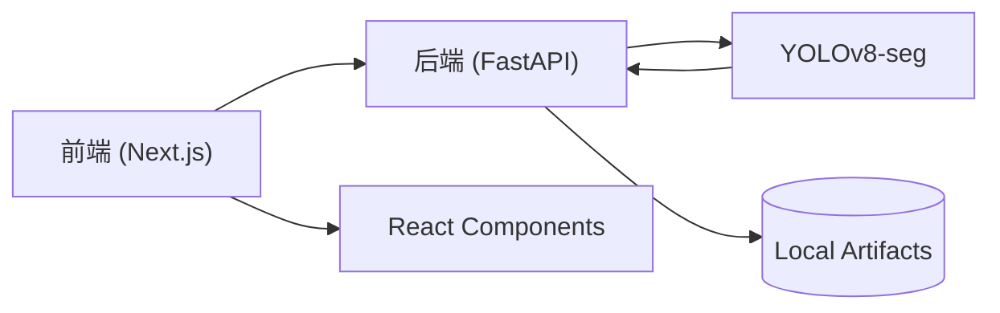

# 🌉 **BDI‑Infra‑Scan** 🚀

> 这是一个面向无人机桥梁巡检场景的 AI 识别系统原型。目标不是只跑通一个模型，而是把“图像输入 -> 病害识别 -> 结果展示 -> 结构化导出 -> 历史回看”做成一个可持续演进的产品原型。

---

## 目录

- [快速开始](#快速开始)
- [主要特性](#主要特性)
- [演示](#演示)
- [使用说明](#使用说明)
- [技术架构](#技术架构)
- [项目结构](#项目结构)
- [贡献指南](#贡献指南)
- [许可证](#许可证)
- [致谢](#致谢)

---

## 主要特性

- ⚡ **极速渲染**：基于 Next.js 16 + Webpack 5，首屏 < 1 s
- 🎨 **极客 UI**：玻璃态、渐变、微动画，打造高科技工作台
- 🤖 **AI 诊断**：集成 `YOLOv8‑seg`，支持裂缝、破损、梳齿缺陷、孔洞、钢筋外露与渗水六类病害识别
- 📊 **多模型对比**：支持模型切换、置信度过滤、一键导出
- 📁 **历史回看**：上传记录持久化，支持批量导出 JSON 与结果图，并区分 `MASK` / `BBOX ONLY`

---

## 演示

> 📺 **功能演示**：
> 体验完整流程：上传图片 → 实时检测 → 结果对比 → 导出
>
> *(💡 建议后续在此处添加一张系统操作的动态 `.gif`，可以使用相对路径注入，例如：``)*

---

## 快速开始

```bash
# 克隆仓库
git clone https://github.com/Timcai06/BDI.git
cd BDI

# 安装前端依赖
cd frontend
npm ci
cd ..

# 可选：把 bdi 命令加入 PATH，之后可直接使用 `bdi ...`
ln -sf "$(pwd)/scripts/bdi" /usr/local/bin/bdi
# 或者添加到 PATH：export PATH="$(pwd)/scripts:$PATH"

# 不改 PATH 的情况下，也可以直接使用仓库内包装脚本
./bdi check
```

> **Tip**：若只想快速预览 UI，可运行 `./bdi run mock`。如果你已把 `scripts/bdi` 加入 `PATH`，也可以直接运行 `bdi run mock`。

---

## 使用说明

### 启动命令

- `./bdi run` – 同时启动前端 + 真实后端
- `./bdi run mock` – 启动前端 + mock 后端，便于 UI 调试
- `./bdi status` – 查看当前服务状态
- `./bdi stop` – 停止所有运行中的服务

如果你已经把 `scripts/bdi` 加入 `PATH`，以上命令里的 `./bdi` 也可以替换成 `bdi`。

### 脚本快捷入口

```bash
./scripts/dev-frontend.sh      # 前端开发服务器
./scripts/dev-backend-mock.sh  # Mock 后端
./scripts/dev-backend-real.sh  # 真正推理后端
./scripts/dev-check.sh         # 环境检查脚本
```

### 开发者快速入口

- 快速文档：[`docs/developer-quickstart.md`](/Users/tim/BDI/docs/developer-quickstart.md)
- 前端类型同步：`rtk npm --prefix frontend run generate:types`

---

## 技术架构



- **前端**：Next.js 16、TailwindCSS、React 19
- **后端**：FastAPI、Python 3.12、ultralytics YOLOv8‑seg
- **存储**：本地文件产物，用于历史记录、结果图、诊断文本与模型输出管理

---

## 项目结构

```
.
├── AGENTS/          # 项目知识库、产品目标、架构约束
├── backend/         # FastAPI 后端实现 & 测试
├── frontend/        # Next.js 前端实现 & UI 组件
├── for_crt/         # 项目方针、分析文档
├── plan/            # 阶段性开发计划
├── scripts/         # 开发/部署脚本
└── README.md        # 本文件
```

---

## 贡献指南

1. Fork 本仓库
2. 创建特性分支 `git checkout -b feat/your-feature`
3. 编写代码并通过 **ESLint、测试与构建** 检查
4. 提交时遵循 **Conventional Commits**（`feat:`, `fix:` 等）
5. 发起 Pull Request，CI 将自动运行 lint、test、build

> **代码规范**：前端使用 `npm run lint`、`npm run test`、`npm run build`，后端按虚拟环境内的测试与检查命令执行。

---

## 许可证

本项目采用 **MIT License**，详见 `LICENSE` 文件。

---

## 致谢

- **ultralytics** 提供的 YOLOv8‑seg 模型
- **Next.js** 与 **FastAPI** 社区的开源贡献
- 项目所有贡献者与使用者的宝贵反馈

---

*本 README 采用 **GitHub Flavored Markdown**，在 GitHub 页面可直接渲染。*
