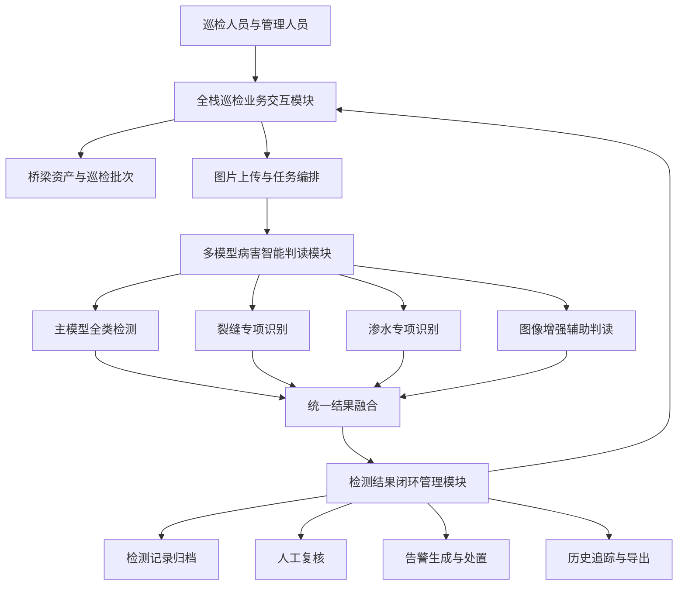
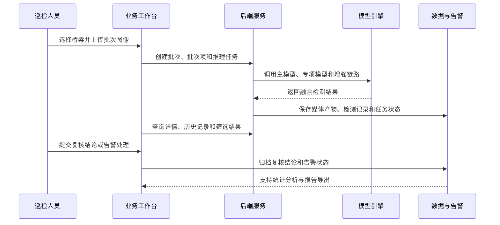

# 第 2 章 系统创新 {.unnumbered .unlisted}

## BDI-Infra-Scan 桥梁病害智能判读系统 {.unnumbered .unlisted}

---

**章节定位**：完整项目报告第 2 章  
**章节主题**：系统创新与总体流程  
**日期**：2026年4月  

---

# 本章摘要 {.unnumbered .unlisted}

本章围绕 BDI-Infra-Scan 桥梁病害智能判读系统的总体创新展开，重点说明系统如何从单一模型推理扩展为面向桥梁巡检业务的完整智能判读平台。系统以无人机巡检图像为主要输入，结合多模型协同识别、图像增强辅助判读、批量异步处理、检测结果归档、人工复核与告警闭环，形成从数据采集到运维处置的完整链路。

与仅完成算法验证或单图识别演示的方案不同，本系统将模型能力、业务流程和工程平台统一组织：模型侧支持主模型与专项模型协同推理，业务侧支持桥梁资产、巡检批次、任务状态、检测记录、复核结论和告警信息的持续管理，交互侧提供面向巡检人员和管理人员的全栈工作台。系统创新的核心不在于增加单个功能点，而在于把桥梁病害智能识别能力嵌入可复用、可追踪、可扩展的工程流程中。

**关键词**：系统创新、桥梁病害识别、多模型协同、图像增强、批量巡检、复核告警、全栈闭环

---

# 目录

第 2 章 系统创新  
2.1 系统结构  
2.1.1 多模型病害智能判读模块  
2.1.2 全栈巡检业务交互模块  
2.1.3 检测结果闭环管理模块  
2.2 系统流程  
2.3 本章小结  

# 2 系统创新

桥梁巡检场景中的病害识别不仅要求模型能够在图像中定位裂缝、渗水、剥落等缺陷，还要求系统能够承接真实业务流程中的图片批量处理、结果查询、状态追踪、人工复核和告警处置。若系统只停留在单图上传与单次识别层面，模型输出很难转化为可持续管理的巡检数据，也无法支撑后续运维决策。

BDI-Infra-Scan 的系统创新体现在“模型能力工程化”和“巡检流程闭环化”两个方面。一方面，系统通过主模型、专项模型和融合策略组织不同识别能力，使模型可以根据病害类型和运行策略灵活组合；另一方面，系统围绕桥梁资产、巡检批次、异步任务、检测记录、增强结果、人工复核和告警管理建立完整链路，使识别结果能够进入可追溯、可复查、可扩展的业务系统。

## 2.1 系统结构

系统总体上由多模型病害智能判读模块、全栈巡检业务交互模块和检测结果闭环管理模块组成。三个模块分别对应“如何识别”“如何使用”“如何沉淀和处置”，共同支撑桥梁巡检图像从输入到输出、从检测到复核、从结果到告警的完整流程。

**图 2-1 系统结构图**

图 2-1 展示了系统的核心结构。全栈巡检业务交互模块面向用户提供桥梁、批次、上传、任务和结果页面；多模型病害智能判读模块负责完成原始图像、增强图像和多模型结果的统一推理；检测结果闭环管理模块则把模型输出转化为可查询、可复核、可告警、可导出的业务数据。

### 2.1.1 多模型病害智能判读模块

多模型病害智能判读模块是系统的智能分析核心。传统单模型方案通常将所有病害类别交由一个模型完成识别，虽然流程简单，但在裂缝、渗水等细粒度或低对比度病害场景下，容易受到图像质量、拍摄角度、病害尺度和背景干扰的影响。本系统采用主模型与专项模型协同的方式，将通用覆盖能力和特定病害识别能力结合起来。

该模块主要包含三类能力：

| 能力 | 作用 | 系统创新点 |
|------|------|------------|
| 主模型全类检测 | 对桥梁图像中的主要病害进行统一识别 | 保证系统具备基础覆盖能力 |
| 专项模型识别 | 面向裂缝、渗水等重点病害进行补充识别 | 提升细粒度病害的适配能力 |
| 图像增强辅助判读 | 对低质量或不清晰图像生成增强结果后再识别 | 使增强图和增强检测结果进入正式结果链路 |

在系统设计上，多模型能力并不是通过前端分别调用多个接口来拼接，而是由后端模型引擎统一管理模型注册、模型运行、结果融合和结果回传。这样可以保证前端业务流程保持稳定，同时允许后续继续增加新的专项模型或调整融合策略。

### 2.1.2 全栈巡检业务交互模块

全栈巡检业务交互模块是系统面向用户的直接入口。巡检人员可以在系统中维护桥梁资产、创建巡检批次、批量上传无人机图像并查看处理状态；管理人员可以查看历史结果、筛选病害记录、进入详情页复核结果，并对异常检测结果进行告警处理。

该模块的创新点在于把“模型推理入口”扩展为“巡检业务工作台”。用户不需要直接理解模型文件、推理脚本或结果目录，而是通过页面完成完整业务操作。系统将上传、排队、推理、失败重试、结果展示、增强补算和历史查询统一封装在前后端协同流程中，使模型能力可以被非算法人员稳定使用。

从业务视角看，该模块承担以下职责：

| 功能入口 | 主要作用 | 对系统创新的支撑 |
|----------|----------|------------------|
| 桥梁管理 | 维护桥梁基础信息 | 让检测结果具备明确资产归属 |
| 批次管理 | 组织一次巡检任务中的多张图像 | 支撑无人机巡检的批量工作方式 |
| 任务处理 | 跟踪排队、运行、成功、失败等状态 | 提升系统运行过程的可观测性 |
| 结果详情 | 展示原图、检测框、增强图和检测列表 | 将模型输出转化为可阅读结果 |
| 历史查询 | 按时间、桥梁、类别和状态检索结果 | 支撑后续复查和报告生成 |

### 2.1.3 检测结果闭环管理模块

检测结果闭环管理模块负责将模型输出转化为可管理的业务结论。桥梁病害识别结果如果只停留在一次性展示，就难以支撑工程运维。本系统把检测结果进一步组织为检测记录、增强结果、人工复核、告警状态和历史归档，使每一次识别都能被追踪和复查。

该模块的核心创新是建立“智能判读 - 人工复核 - 告警处置 - 历史沉淀”的闭环。模型给出初步检测结果后，系统根据病害类别、置信度和规则策略生成可处理记录；人工复核用于修正模型输出或确认风险；告警模块用于将重点病害转化为运维事件；历史归档则为后续统计分析、模型优化和巡检报告提供数据基础。

通过这一闭环，系统避免了“识别完成即结束”的问题，使检测结果能够持续服务于桥梁管养流程。

## 2.2 系统流程

系统流程从无人机巡检图像进入系统开始，经过桥梁和批次组织、异步任务处理、多模型协同推理、增强结果生成、检测结果融合、人工复核与告警处置，最终形成可查询、可导出、可追溯的巡检数据。

**图 2-2 系统流程图**

图 2-2 展示了系统的完整处理流程。首先，用户将无人机巡检图像按桥梁和批次组织上传，系统为每张图像生成可追踪任务。随后，后端根据模型策略调用主模型、专项模型和增强链路完成推理，并将多路结果融合为统一检测结果。检测完成后，用户可以在前端查看原图、检测框、增强图和检测列表，并根据需要进行人工复核或告警处置。

该流程体现了本系统区别于普通识别演示系统的三个特点：

1. **批量化处理**  
   系统以巡检批次组织多张图像，适配无人机巡检一次采集大量图片的实际场景。

2. **异步化执行**  
   系统通过任务状态承接排队、运行、成功、失败和重试过程，避免前端长时间等待单次推理。

3. **闭环化管理**  
   检测结果不仅被展示，还进入复核、告警、历史归档和导出流程，形成可持续使用的数据资产。

## 2.3 本章小结

本章从系统结构和系统流程两个角度说明了 BDI-Infra-Scan 的系统创新。系统不是简单地把病害检测模型接入页面，而是围绕桥梁巡检业务构建了多模型协同、批量异步处理、增强辅助判读、检测结果归档、人工复核和告警管理的完整闭环。

从结构上看，系统由多模型病害智能判读模块、全栈巡检业务交互模块和检测结果闭环管理模块组成，分别解决智能识别、业务使用和结果沉淀问题。从流程上看，系统将无人机图像上传、任务生成、模型推理、结果融合、复核告警和历史导出串联为完整链路，使算法能力能够稳定进入实际巡检工作。

后续章节可在本章基础上继续展开模型算法创新、数据集与实验评估，以及第 5 章的软件系统全栈设计与实现。
