# 第 5 章 软件系统全栈设计与实现 {.unnumbered .unlisted}

## BDI-Infra-Scan 桥梁病害智能判读系统 {.unnumbered .unlisted}

---

<div style="text-align: center; margin-top: 100px;">

**章节定位**：完整项目报告第 5 章  
**负责内容**：项目全栈开发与系统落地  
**日期**：2026年4月  

</div>

---

<div style="page-break-after: always;"></div>

# 本章摘要 {.unnumbered .unlisted}

本章作为完整项目报告的第 5 章，聚焦本人负责的全栈软件系统开发工作。完整项目中的模型训练、算法创新、数据集建设与实验评估由其他章节展开；本章只在必要位置说明这些模型与算法能力如何被软件系统接入、调度、融合、落库和展示。

围绕无人机桥梁巡检场景，本章重点说明前端工作台、后端服务、数据库持久化、异步任务、多模型接入、增强结果管理、告警复核闭环与导出诊断能力。前端采用 **Next.js 16 + React 19 + TypeScript + TailwindCSS 4** 构建多页面业务工作台，后端采用 **FastAPI + Pydantic + SQLAlchemy + PostgreSQL** 组织接口、任务、结果和运维域数据。

本章的写作边界是“软件系统如何支撑完整项目落地”：既不重复完整报告前几章的项目背景，也不替代模型与算法章节的创新论证，而是从工程实现角度交代完整业务链路、关键模块职责和可复现材料。

**关键词**：全栈开发、桥梁病害检测系统、Next.js、FastAPI、PostgreSQL、异步任务、多模型接入、运维闭环

---

<div style="page-break-after: always;"></div>

# 目录

第 5 章 软件系统全栈设计与实现  
5.1 软件体系结构  
5.2 软件接口规范  
5.3 前端设计  
5.4 后端设计  
5.5 基本功能  
5.6 核心功能实现  
5.7 本章小结  
附录 A API 接口文档  
附录 B 数据库设计  
附录 C 系统运行与本地复现说明  
附录 D Markdown、Mermaid 与 Word 导出链路  
附录 E 项目结构与关键目录说明  

<div style="page-break-after: always;"></div>

# 5 软件系统全栈设计与实现

> 本章对应参考方案中的“第五部分”。  
> 但本章不复述团队算法训练过程，而是聚焦 **BDI 系统已经完成的软件实现部分**，说明这套系统如何由前端、后端、数据库、模型接入层和异步任务链路共同组成。

---

## 5.1 软件体系结构

### 5.1.1 分层结构

当前系统采用四层结构：展示层、业务服务层、模型引擎层、数据持久层。

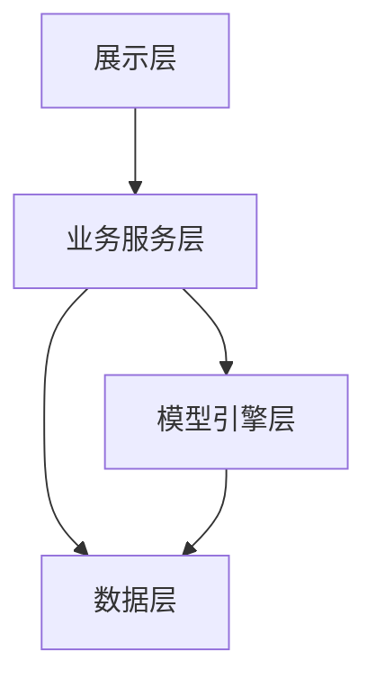

**图 5-1 软件总体分层结构**

### 5.1.2 分层职责

| 层级 | 主要职责 | 在本项目中的体现 |
|------|:---------|------------------|
| 展示层 | 页面渲染、用户交互、状态承接 | 页面入口、页面主体、状态控制、功能区块 |
| 服务层 | 业务编排、接口聚合、错误收口 | Predict、Batch、Task、Result、LLM 门面服务 |
| 引擎层 | 模型解析、推理执行、融合与增强 | Registry、RunnerManager、FusionRunner、EnhancementRunner |
| 数据层 | 持久化、媒体管理、结果归档 | PostgreSQL + 本地 artifact 目录 |

### 5.1.3 业务主链路

本项目的软件设计不是单一推理页面，而是完整巡检链路：

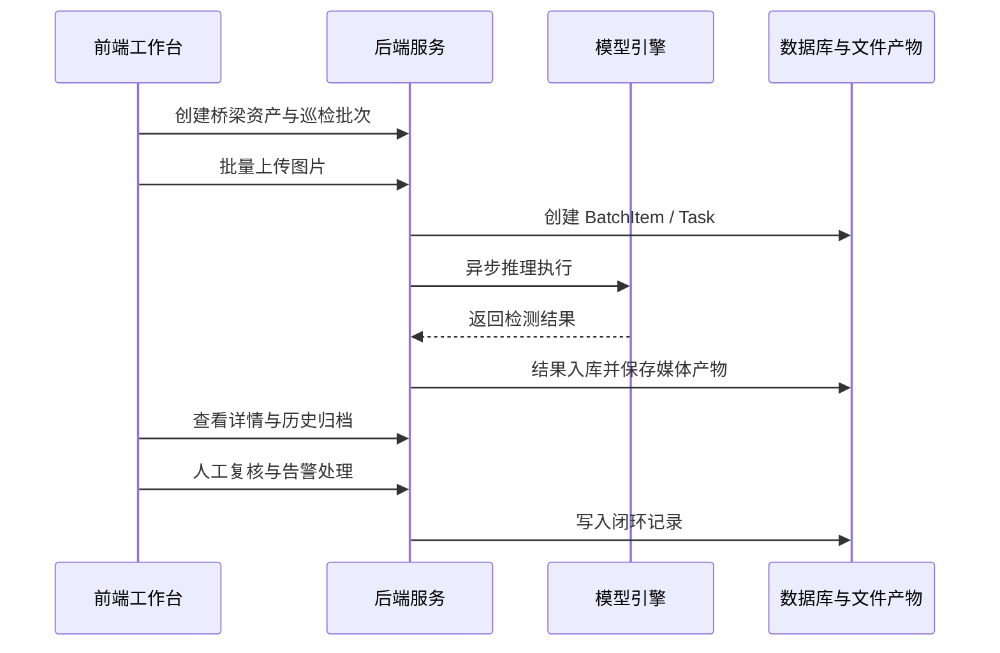

**图 5-2 业务主链路**

图 5-2 概括了系统从桥梁资产到结果闭环的完整主链路，后续章节均围绕这条主线展开。

附录 E 进一步给出了这条主链路在前端、后端和数据层中的源码导航。

> 建议在此处补充软件整体链路图或系统总览截图。  
> [报告/images/architecture/software-flow-overview.png](/Users/tim/BDI/报告/images/architecture/software-flow-overview.png)

---

## 5.2 软件接口规范

### 5.2.1 接口分层

后端接口分为两组：

1. `Legacy API`  
   面向单图推理、结果回看和增强结果。
2. `V1 API`  
   面向桥梁、批次、任务、告警、复核和运营工作台。

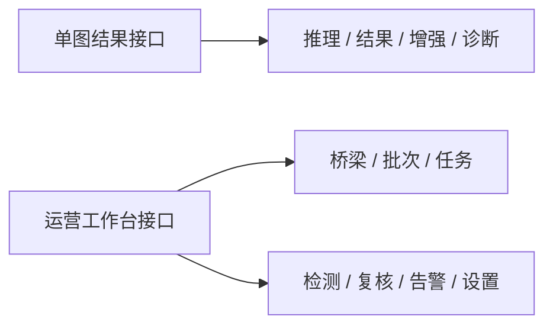

**图 5-3 接口分层结构**

### 5.2.2 接口组织原则

本项目接口设计遵循三条原则：

1. **单图链路与批量链路分开**  
   单图使用 `Legacy API`，批量和运维使用 `V1 API`。
2. **前后端类型以 OpenAPI 契约为准**  
   前端通过生成类型消费后端协议，减少手工维护偏差。
3. **错误返回统一结构**  
   所有核心接口都接入统一错误响应与请求追踪。

统一错误结构：

```json
{
  "error": {
    "code": "INVALID_REQUEST",
    "message": "relative_paths 与 files 数量不一致",
    "details": {}
  }
}
```

同时，每个请求都会带：

- `X-Request-ID`
- `X-Process-Time-Ms`

这保证了页面报错可以直接回溯到后端日志。

### 5.2.3 实际接口代码组织

在当前系统中，Legacy API 与 V1 API 分别承担“单图实验链路”和“企业工作台链路”。接口组织的核心原则不是堆更多端点，而是让路由层足够薄、服务层足够稳定、客户端调用足够统一。

例如，批次创建与批次图片上传都遵循同一套组织方式：前端先把页面语义参数整理为稳定的请求对象，再由接口入口交给批次服务统一处理。这样，页面层不需要直接理解后端字段细节，接口层也不需要承担完整的业务规则。

如需继续从接口入口追踪到服务层，可参见附录 E 的接口入口层与业务服务层说明。

---

## 5.3 前端设计

### 5.3.1 前端技术栈

| 技术 | 用途 | 在项目中的作用 |
|------|------|----------------|
| Next.js 16 | 应用框架 | App Router、多页面组织、构建产物 |
| React 19 | UI 编程模型 | 组件化、状态与交互 |
| TypeScript | 类型系统 | 页面与接口调用类型约束 |
| TailwindCSS 4 | 样式系统 | 快速构建统一视觉语言 |
| Framer Motion | 动效 | 状态切换、页面承接、面板展开 |
| Vitest | 单元测试 | 组件与工具测试 |
| Playwright | E2E | real-mode 主链路浏览器回归 |

### 5.3.2 前端页面结构

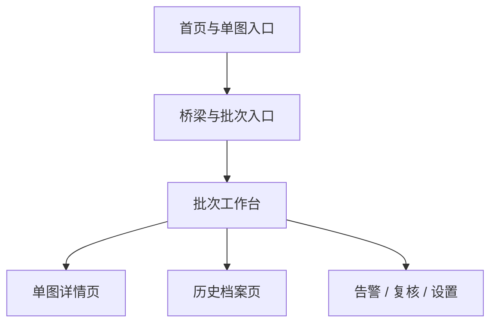

**图 5-4 前端页面结构**

### 5.3.3 页面组织方式

前端页面已经从“大页面组件承接全部逻辑”的方式，逐步演进为“页面主结构 + 页面状态 + 局部区块”的组织方式。这样做的目标，是让页面在继续增加功能时仍然保持可读性和可维护性。

例如批次工作台：

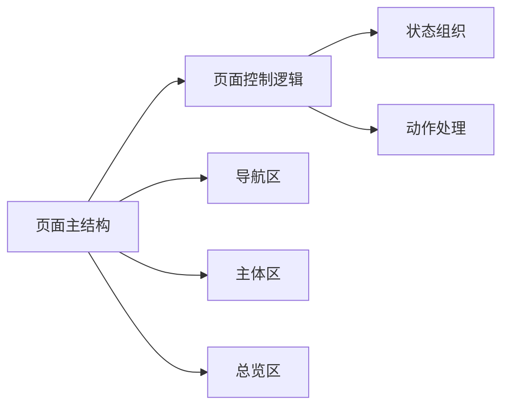

**图 5-5 批次工作台组件协作**

这种分层结构使前端能够持续演进，而不需要把状态、动作和区块逻辑重新堆回单一页面文件。

这样的组织方式有两个好处：

1. 页面布局相对稳定，后续改动集中在状态和业务区块  
2. 更容易补测试和控制回归范围

### 5.3.4 关键页面实现

#### 1. 批次工作台

批次工作台负责：

- 桥梁选择
- 批次切换
- 图片批量上传
- 任务状态查看
- 单图详情跳转
- 失败任务重试

其核心实现模式可以概括为“页面主结构负责布局，页面控制逻辑负责把导航区、总览区和主体区组合成完整界面”。

#### 2. 历史档案页

历史页采用“页面主结构 + 状态组织 + 批次列表区 + 记录清单区”的方式，稳定承接：

- 批次历史查看
- 单图历史打开
- 历史导出与删除

这种设计让批次切换、记录筛选、详情跳转与导出分别落在清晰的页面区域中，避免历史页重新膨胀为单体组件。

#### 3. 结果详情页

结果详情页当前支持：

- 原图 / 结果图 / 掩膜图切换
- 原图识别 / 增强识别切换
- 检测列表、性能指标、诊断展示
- 导出与历史跳转

详情页中增强结果承接采用“双结果源”策略，即主结果和增强结果共用一套结果视图，只是数据源不同。对应结果对象来自后端 `PredictResponse.secondary_result`。

表 5-1A 给出了详情页核心状态设计。

| 状态维度 | 可选值 | 作用 |
|----------|--------|------|
| 图片来源 | 原图 / 增强图 | 控制当前底图来源 |
| 结果来源 | 主结果 / 增强结果 | 控制检测框、检测列表和统计摘要 |
| 视图模式 | 原图 / overlay / mask | 控制主图展示模式 |

这种状态设计使原图、增强图、主结果、增强结果能够独立组合，而不是被绑定成单一视图。

附录 E 的前端客户端与状态层部分补充了详情页状态组织对应的工程位置。

### 5.3.5 页面证据与界面截图

为便于将系统设计与实际实现一一对应，本章预留以下真实页面截图作为证据材料：

- **图 5-6A 批次工作台主界面**  
  [报告/images/screenshots/ops-workbench.png](/Users/tim/BDI/报告/images/screenshots/ops-workbench.png)
- **图 5-6B 历史档案界面**  
  [报告/images/screenshots/history-route.png](/Users/tim/BDI/报告/images/screenshots/history-route.png)
- **图 5-6C 单图详情界面**  
  [报告/images/screenshots/ops-item-detail.png](/Users/tim/BDI/报告/images/screenshots/ops-item-detail.png)
- **图 5-6D 增强结果切换界面**  
  [报告/images/screenshots/detail-enhanced-toggle.png](/Users/tim/BDI/报告/images/screenshots/detail-enhanced-toggle.png)
- **图 5-6E 结果侧栏与统计区**  
  [报告/images/screenshots/detail-result-panels.png](/Users/tim/BDI/报告/images/screenshots/detail-result-panels.png)
- **图 5-6F 告警中心界面**  
  [报告/images/screenshots/ops-alerts.png](/Users/tim/BDI/报告/images/screenshots/ops-alerts.png)

---

## 5.4 后端设计

### 5.4.1 后端技术栈

| 技术 | 用途 | 当前角色 |
|------|------|----------|
| FastAPI | Web 框架 | 提供 Legacy API 与 V1 API |
| Pydantic | 数据模型 | 请求/响应校验与序列化 |
| SQLAlchemy 2 | ORM | 数据持久化与查询 |
| PostgreSQL | 业务数据库 | 桥梁、批次、任务、检测、告警、复核 |
| Uvicorn | 运行服务 | 本地开发与演示启动 |

### 5.4.2 后端服务拆分

后端服务已不是单体文件，而是按职责拆分为：

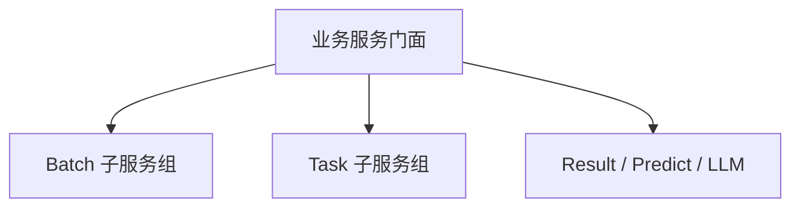

**图 5-6 后端服务拆分结构**

图 5-6 反映的是后端服务从“单体大服务”演进到“门面服务 + 领域子服务”的过程。门面层负责向路由层提供稳定入口，Batch 子服务组负责批次校验、入库、写操作、查询、告警与复核联动，Task 子服务组负责异步执行、失败重试、增强补算和任务告警。这种设计既保留了 API 层调用习惯，又降低了单个服务文件持续膨胀的风险。

门面层负责向接口层提供稳定入口，具体的校验、入库、查询、告警与复核处理则下沉到各自的业务模块中。这种做法既保留了对外接口的稳定性，也避免单个服务文件继续膨胀。

这些门面与子服务在工程中的主要分布，可在附录 E 的后端服务层中继续查看。

### 5.4.3 模型引擎设计

模型引擎的关键目标不是简单加载一个 `.pt` 文件，而是支持：

- 主模型版本管理  
- 多专项模型覆盖  
- 融合输出统一为一套结果协议  
- 运行时与权重路径解耦

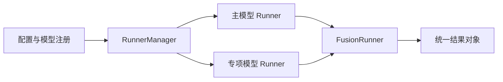

**图 5-7 模型引擎与多专项融合结构**

图 5-7 展示的是模型引擎的核心设计：配置层与注册层决定可用模型版本，`RunnerManager` 负责装配主模型和专项模型 runner，`FusionRunner` 负责把主模型结果与渗水、裂缝等专项模型结果融合成统一结果对象。这样设计的目标不是追求单一模型入口，而是让主模型与专项模型能够在统一协议下协同工作，并稳定回传到业务链路。

这套设计使当前系统能够同时接入：

- 主模型 `main-latest-mask-v1`
- 渗水专项模型
- 裂缝专项模型
- 多专项融合版本 `fusion-main-water-crack-mask-v1`

融合阶段会根据类别和 IoU 去重规则完成专项覆盖与结果合并。后端真实颜色定义也在融合层统一输出，保证前端列表、框线、overlay 图颜色一致。

如果读者希望进一步查看模型注册、runner 装配与 fusion 配置的目录位置，可参见附录 E 的模型接入层导航。

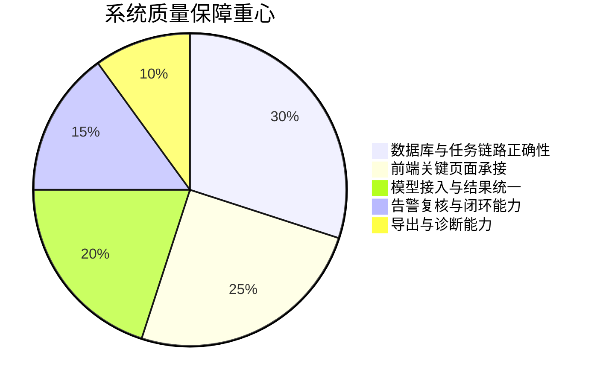

**图 5-8 系统质量保障重心**

### 5.4.4 结果与增强链路

当前结果承接不是“单图跑完即结束”，而是把结果拆成两类：

1. 主结果 `primary result`
2. 增强结果 `secondary_result`

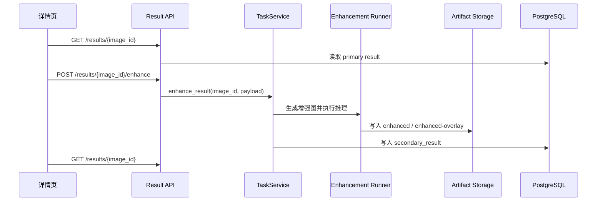

**图 5-9 增强结果补算与回读链路**

这条链路保证旧记录也可以“事后补算增强结果”，而不是必须重新上传整批图像。

> 建议在此处补充增强前后结果展示、增强按钮和增强结果详情截图。  
> [报告/images/screenshots/detail-enhanced-toggle.png](/Users/tim/BDI/报告/images/screenshots/detail-enhanced-toggle.png)

### 5.4.5 接口入口与服务协作

这一层的关键不是某一个具体函数，而是接口入口和业务服务之间的协作边界已经稳定：

- 接口入口负责参数接收、响应组织和错误回传；
- 业务服务负责批次、任务、增强、重试等动作的统一编排；
- 查询模块负责读路径优化；
- 模型引擎负责推理执行、融合和结果统一。

这意味着系统在继续增加模型能力或页面功能时，不需要同时改动前端页面、后端接口和模型执行逻辑，而是可以沿着既有边界分别演进。

模型层的关键目标是：**不同模型、不同运行时、不同融合策略可以在不改业务接口的前提下接入系统。**

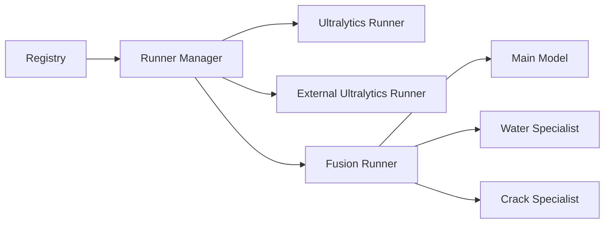

当前系统已经具备：

- 主模型
- 渗水专项模型
- 裂缝专项模型
- 多专项融合版本
- 增强后再识别结果链路

### 5.4.6 持久化设计

数据库与文件产物是并行存储的：

| 类型 | 位置 | 内容 |
|------|------|------|
| 结构化业务数据 | PostgreSQL | Bridge、Batch、Task、Result、Detection、Alert、Review |
| 上传原图与结果媒体 | artifact 存储目录 | 原图、overlay、增强图、增强 overlay |
| 模型权重 | `backend/models` | 主模型、专项模型 |
| 外部运行时 | `backend/external_runtimes` | 多运行时模型推理环境 |

这样做的好处是：

1. 数据库负责结构化管理  
2. 文件系统负责承接体积更大的图像与结果产物  
3. 结果详情页和历史页可以直接通过 `image / overlay / enhanced / enhanced-overlay` 路由取资源

---

## 5.5 基本功能

### 5.5.1 桥梁资产管理

桥梁是系统中的第一层业务对象，用于承接长期资产上下文。  
当前已实现：

- 创建桥梁
- 查询桥梁列表
- 桥梁详情查看
- 删除桥梁（级联删除桥下批次）

### 5.5.2 批次管理

批次是某座桥下一次巡检会话。当前已实现：

- 创建批次
- 批量上传图片
- 任务自动创建
- 批次状态统计
- 失败任务重试
- 批次删除

### 5.5.3 历史档案

历史档案页用于承接结果归档和回溯：

- 历史批次查看
- 单图历史详情
- 批量删除
- 导出结果

### 5.5.4 告警与复核

检测结果不仅用于展示，还进入后续运维闭环：

- 规则驱动告警
- 告警状态流转
- 人工复核记录
- 告警 / 复核页面检索与处理

### 5.5.5 设置与策略管理

当前设置页主要用于：

- 告警规则读取与更新
- 规则审计记录查看
- 运营策略说明

这些功能已经纳入 real-mode E2E 回归，说明不只是 UI 页面，而是接了真实后端链路。

---

## 5.6 核心功能实现

### 5.6.1 单图推理

单图推理仍然是最基础的链路：

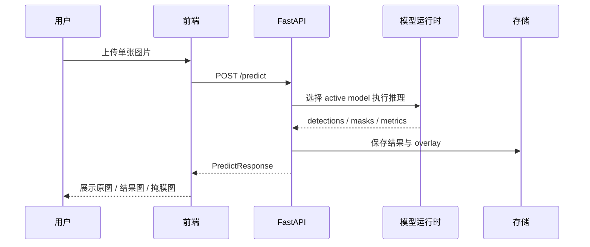

**图 5-10 单图推理链路**

这一链路的价值在于：

- 可快速验证模型可用性
- 可承接单图实验与效果比对
- 为历史结果和增强结果提供统一详情页基础

### 5.6.2 批量异步处理

批量推理是系统从“演示页”走向“工作台”的关键。

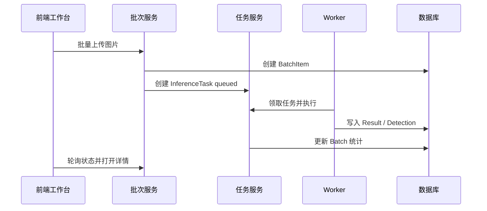

**图 5-11 批量异步处理链路**

当前系统已经支持：

- 上传校验
- 任务排队
- 失败重试
- 任务状态可视化
- 批次终态停轮询

### 5.6.3 多模型融合

系统当前的模型策略不是“一个模型跑到底”，而是：

- 主模型负责全类覆盖
- 渗水专项模型负责 `seepage`
- 裂缝专项模型负责 `crack`
- Fusion Runner 负责合并结果

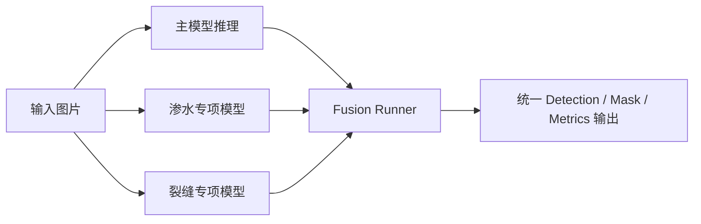

**图 5-12 多模型融合处理链路**

这套设计的核心价值不是“模型更多”，而是：

1. 业务接口不变  
2. 专项能力可以叠加  
3. 前端和数据库只消费统一结果结构

### 5.6.4 增强结果管理

增强链路当前已从“增强图展示”提升为“增强结果展示”：

- 原图识别仍然保留
- 记录详情页可切换查看增强识别
- 无增强结果时可一键触发增强补算

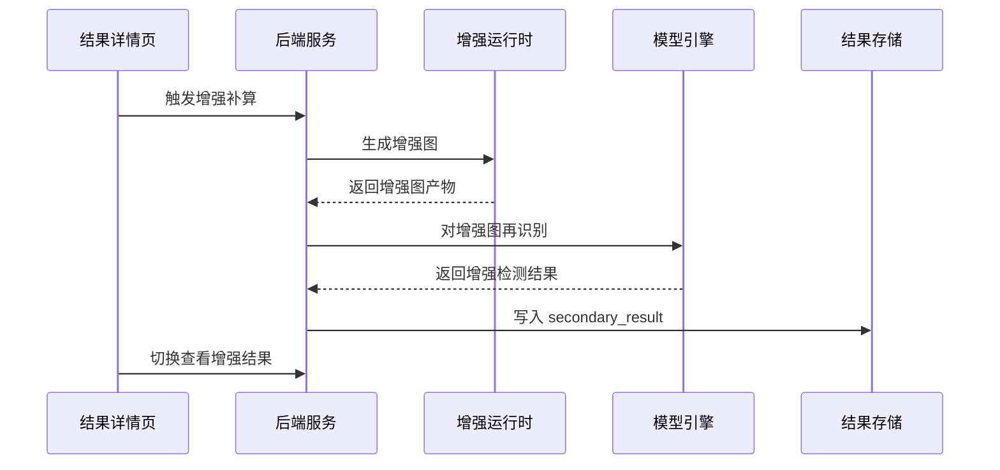

**图 5-13 增强结果管理链路**

这使增强结果不再只是附件，而成为同一条记录下的第二套正式结果。

### 5.6.5 结果详情页

结果详情页是系统中最重要的结果承接面板之一，当前集成了：

- 图像展示
- 结果 overlay / mask
- 检测列表
- 性能分析
- 增强切换
- 导出
- 诊断生成

这也是为什么本项目的软件实现重点不只是“模型跑出来了”，而是“结果如何被完整承接、解释和管理”。

> 建议在此处补充结果详情页原图、overlay、mask 与检测列表的真实界面截图。  
> [报告/images/screenshots/detail-result-panels.png](/Users/tim/BDI/报告/images/screenshots/detail-result-panels.png)

### 5.6.6 工程边界总结

这说明系统当前已经形成了稳定的工程边界：

- 接口层负责协议入口
- 服务层负责业务编排
- 查询层负责读路径优化
- 引擎层负责模型执行与融合

---

## 5.7 本章小结

对照参考 PDF 的“第五部分”，本项目的软件设计与实现已经不是传统桌面端单体程序，而是一套围绕桥梁巡检业务组织起来的 Web 系统：

- 前端支持桥梁、批次、历史、告警、复核、设置等多页面工作台
- 后端支持单图、批量、增强、导出、诊断、告警与审计
- 模型层支持主模型、专项模型和多模型融合
- 数据层支持结构化入库与媒体产物双轨存储

因此，第 5 章应当被视为整份报告里最能体现本系统实现能力的章节，而不是算法训练内容的附属占位。


<div style="page-break-after: always;"></div>

# 附录 A：API 接口文档

## A.1 说明

当前系统存在两组接口：

1. **Legacy API**：面向单图推理与结果查看  
2. **V1 Ops API**：面向桥梁、批次、任务、复核、告警与设置

两组接口共同构成系统完整链路。实际接口以 FastAPI 路由文件为准：

- Legacy 路由模块
- V1 路由模块

此外，系统已实现统一错误格式和请求追踪头：

- `X-Request-ID`
- `X-Process-Time-Ms`

错误响应统一为：

```json
{
  "error": {
    "code": "INVALID_REQUEST",
    "message": "错误说明",
    "details": {}
  }
}
```

## A.2 Legacy API

### A.2.1 健康检查

**GET `/health`**

用于确认服务状态、当前激活模型和运行时就绪情况。

响应示例：

```json
{
  "service": "bdi-backend",
  "version": "1.0.0",
  "ready": true,
  "active_runner": "fusion-main-water-crack-mask-v1",
  "storage_root": "/artifacts",
  "details": {
    "active_backend": "fusion",
    "cache_hit": false
  }
}
```

### A.2.2 模型列表

**GET `/models`**

返回当前注册表中的模型版本与可用性状态。

响应示例：

```json
{
  "active_version": "fusion-main-water-crack-mask-v1",
  "items": [
    {
      "model_name": "主模型",
      "model_version": "main-latest-mask-v1",
      "backend": "external_ultralytics",
      "supports_masks": true,
      "is_active": false,
      "is_available": true
    },
    {
      "model_name": "融合模型",
      "model_version": "fusion-main-water-crack-mask-v1",
      "backend": "fusion",
      "supports_masks": true,
      "is_active": true,
      "is_available": true
    }
  ]
}
```

### A.2.3 单图推理

**POST `/predict`**

这是单图实验页和传统结果链路的入口。请求采用 `multipart/form-data`。

核心参数：

| 参数 | 类型 | 说明 |
|------|------|------|
| `file` | file | 原始图片 |
| `confidence` | float | 置信度阈值 |
| `iou` | float | IoU 阈值 |
| `inference_mode` | string | 推理模式 |
| `model_version` | string | 指定模型版本，可为空表示当前 active |
| `return_overlay` | bool | 是否返回 overlay 链接 |
| `pixels_per_mm` | float | 像素与物理尺寸换算系数 |

```python
@router.post("/predict", response_model=PredictResponse)
async def predict(
    request: Request,
    file: Annotated[UploadFile, File(...)],
    confidence: Annotated[float, Form()] = 0.25,
    iou: Annotated[float, Form()] = 0.45,
    inference_mode: Annotated[str, Form()] = "direct",
    model_version: Annotated[Optional[str], Form()] = None,
    return_overlay: Annotated[bool, Form()] = False,
    pixels_per_mm: Annotated[float, Form()] = 10.0,
) -> PredictResponse:
    ...
```

响应结构核心字段：

| 字段 | 说明 |
|------|------|
| `image_id` | 结果主键 |
| `result_variant` | `original` 或 `enhanced` |
| `inference_ms` | 推理耗时 |
| `model_version` | 实际模型版本 |
| `detections` | 检测结果数组 |
| `artifacts` | 原图、overlay、json 等链接 |
| `secondary_result` | 增强后的第二套结果 |

### A.2.4 结果与媒体资源

Legacy 结果接口围绕 `image_id` 组织：

| 方法 | 路径 | 作用 |
|------|------|------|
| GET | `/results` | 结果列表 |
| GET | `/results/{image_id}` | 获取单条结构化结果 |
| GET | `/results/{image_id}/image` | 原图 |
| GET | `/results/{image_id}/overlay` | overlay 图 |
| GET | `/results/{image_id}/enhanced` | 增强图 |
| GET | `/results/{image_id}/enhanced-overlay` | 增强 overlay 图 |
| POST | `/results/{image_id}/enhance` | 对已有记录补算增强结果 |
| GET | `/results/{image_id}/diagnosis` | 获取诊断文本 |
| POST | `/results/{image_id}/diagnosis` | 生成诊断文本 |

其中，增强补算接口使旧记录也能在详情页获得“增强”按钮对应的数据源。

## A.3 V1 Ops API

### A.3.1 桥梁与批次

桥梁和批次是运营链路的第一层与第二层对象。

| 方法 | 路径 | 说明 |
|------|------|------|
| POST | `/api/v1/bridges` | 创建桥梁 |
| GET | `/api/v1/bridges` | 分页查询桥梁 |
| GET | `/api/v1/bridges/{bridge_id}` | 查询单座桥梁 |
| DELETE | `/api/v1/bridges/{bridge_id}` | 删除桥梁，级联清理其批次 |
| POST | `/api/v1/batches` | 创建批次 |
| GET | `/api/v1/batches` | 分页查询批次 |
| GET | `/api/v1/batches/{batch_id}` | 查询单个批次 |
| DELETE | `/api/v1/batches/{batch_id}` | 删除批次 |

桥梁创建请求的真实结构如下：

```json
{
  "bridge_code": "BRIDGE-001",
  "bridge_name": "示例桥梁",
  "bridge_type": "beam",
  "region": "浙江省",
  "manager_org": "养护单位",
  "longitude": 120.12,
  "latitude": 30.28
}
```

批次创建请求的真实结构如下：

```json
{
  "bridge_id": "br_xxx",
  "source_type": "uav",
  "expected_item_count": 50,
  "created_by": "tim",
  "inspection_label": "2026-04 巡检",
  "enhancement_mode": "always"
}
```

### A.3.2 批次上传与查询

| 方法 | 路径 | 说明 |
|------|------|------|
| POST | `/api/v1/batches/{batch_id}/items` | 上传批次图片 |
| GET | `/api/v1/batches/{batch_id}/items` | 分页查询批次素材 |
| GET | `/api/v1/batches/{batch_id}/stats` | 获取批次聚合统计 |
| GET | `/api/v1/batch-items/{batch_item_id}` | 获取批次项详情 |
| GET | `/api/v1/batch-items/{batch_item_id}/result` | 获取批次项结构化结果 |

上传接口的表单参数：

| 参数 | 类型 | 说明 |
|------|------|------|
| `files` | file[] | 图片文件列表 |
| `relative_paths` | string[] | 客户端相对路径 |
| `source_device` | string | 采集设备 |
| `captured_at` | datetime | 采集时间 |
| `model_policy` | string | 模型策略 |
| `enhancement_mode` | string | `off / auto / always` |

### A.3.3 任务、检测、复核、告警

| 方法 | 路径 | 说明 |
|------|------|------|
| GET | `/api/v1/tasks/{task_id}` | 查询任务详情 |
| POST | `/api/v1/tasks/process-next` | 手动处理下一个排队任务 |
| POST | `/api/v1/tasks/{task_id}/retry` | 重试失败任务 |
| GET | `/api/v1/detections` | 查询检测结果 |
| POST | `/api/v1/reviews` | 创建复核记录 |
| GET | `/api/v1/reviews` | 查询复核记录 |
| POST | `/api/v1/alerts` | 创建告警 |
| GET | `/api/v1/alerts` | 查询告警 |
| POST | `/api/v1/alerts/{alert_id}/status` | 更新告警状态 |

检测查询支持的主要过滤项包括：

- `batch_id`
- `batch_item_id`
- `category`
- `min_confidence`
- `max_confidence`
- `min_area_mm2`
- `is_valid`
- `sort_by`
- `sort_order`

### A.3.4 运营总览与设置

| 方法 | 路径 | 说明 |
|------|------|------|
| GET | `/api/v1/ops/metrics` | 获取运营总览 KPI |
| GET | `/api/v1/ops/alert-rules` | 获取告警规则 |
| PUT | `/api/v1/ops/alert-rules` | 更新告警规则 |
| GET | `/api/v1/ops/alert-rules/audit` | 获取告警规则审计日志 |

告警规则更新请求示例：

```json
{
  "updated_by": "tim",
  "alert_auto_enabled": true,
  "count_threshold": 3,
  "category_watchlist": ["seepage", "crack"],
  "category_confidence_threshold": 0.8,
  "repeat_escalation_hits": 2,
  "sla_hours_by_level": {
    "low": 72,
    "medium": 48,
    "high": 24,
    "critical": 12
  },
  "near_due_hours": 2
}
```

## A.4 关键返回对象

### A.4.1 `PredictResponse`

这是系统最关键的结果对象，Legacy 结果链路和增强链路都围绕它组织。

```python
class PredictResponse(BaseModel):
    image_id: str
    result_variant: Literal["original", "enhanced"] = "original"
    inference_ms: int
    model_name: str
    model_version: str
    backend: str
    detections: list[Detection]
    artifacts: ArtifactLinks
    secondary_result: Optional["PredictResponse"] = None
```

### A.4.2 `BatchItemDetailResponse`

批次工作台和历史详情页都依赖它来展示素材与任务上下文。

核心字段包括：

- `processing_status`
- `review_status`
- `latest_task_status`
- `latest_failure_code`
- `resolved_model_version`
- `latest_result_id`
- `defect_count`
- `alert_status`
- `media_asset`

## A.5 接口截图与材料补充建议

建议在以下位置补充真实截图或接口调试截图：

- [报告/images/screenshots/api-swagger.png](/Users/tim/BDI/报告/images/screenshots/api-swagger.png)  
  Swagger UI 首页截图
- [报告/images/screenshots/api-batch-upload.png](/Users/tim/BDI/报告/images/screenshots/api-batch-upload.png)  
  批次上传接口调试截图
- [报告/images/screenshots/api-result-detail.png](/Users/tim/BDI/报告/images/screenshots/api-result-detail.png)  
  单图结果接口返回截图

## A.6 小结

当前 API 设计的核心特点是：

- 兼容单图推理与批量运营两套使用方式  
- 结果对象统一，增强结果通过 `secondary_result` 形成第二视图  
- 路由层保持薄层，业务规则下沉到服务层  
- 统一错误格式和请求追踪使接口更易调试与排障


<div style="page-break-after: always;"></div>
# 附录 B：数据库设计

## B.1 设计说明

系统数据库采用 `PostgreSQL + SQLAlchemy ORM`。数据库并不只是保存“检测结果”，而是同时承担以下职责：

1. 保存桥梁、批次、任务等业务对象  
2. 保存单图推理与批量推理的结构化结果  
3. 保存告警、复核、配置、审计等运营数据  
4. 与文件产物目录共同完成“结构化数据 + 媒体资源”的双轨持久化

实际数据模型定义位于：

- 桥梁资产模型
- 巡检批次模型
- 批次记录模型
- 推理任务模型
- 结果与检测模型
- 告警、复核、配置与审计模型

数据库设计并不是“单张图片结果表”的扩展，而是围绕桥梁巡检闭环完整建模。下面这段 ORM 代码可以说明桥梁与批次的一对多关系是如何在实现层表达的：

```python
class Bridge(Base):
    __tablename__ = "bridges"

    id = mapped_column(String, primary_key=True)
    bridge_code = mapped_column(String, unique=True, nullable=False)
    bridge_name = mapped_column(String, nullable=False)
    status = mapped_column(String, nullable=False, default="active")

    batches = relationship("InspectionBatch", back_populates="bridge", cascade="all, delete-orphan")


class InspectionBatch(Base):
    __tablename__ = "inspection_batches"

    id = mapped_column(String, primary_key=True)
    bridge_id = mapped_column(ForeignKey("bridges.id"), nullable=False)
    batch_code = mapped_column(String, unique=True, nullable=False)
    status = mapped_column(String, nullable=False, default="created")

    bridge = relationship("Bridge", back_populates="batches")
```

## B.2 核心实体关系

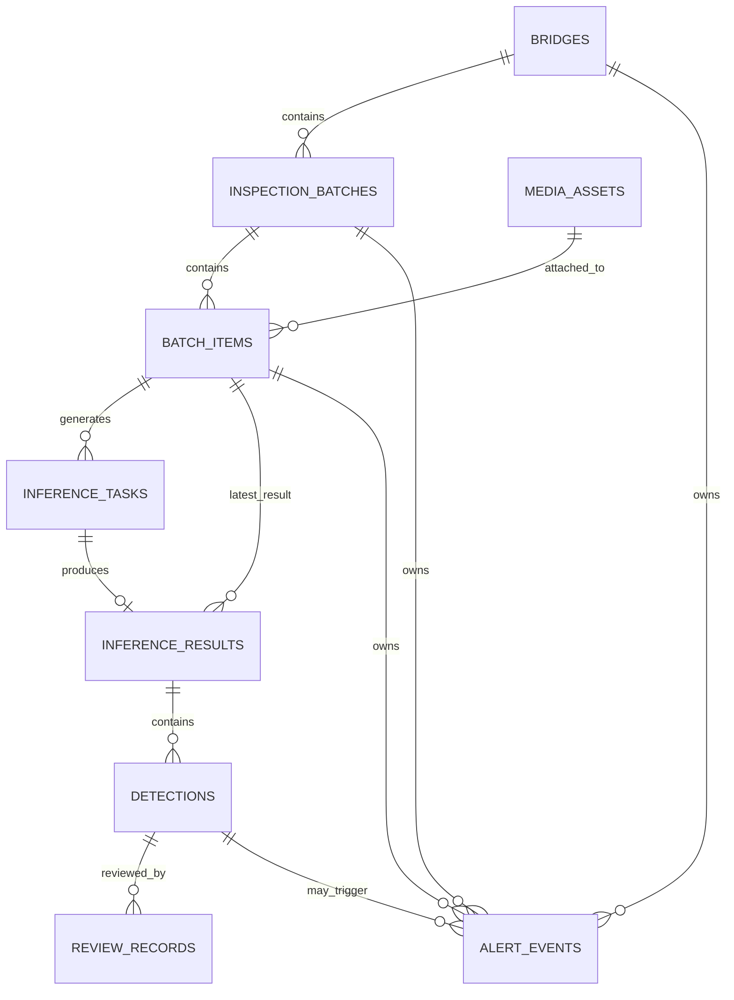

这套关系体现了系统的主数据链路：

`桥梁 -> 批次 -> 批次项 -> 任务 -> 结果 -> 检测 -> 复核 / 告警`

> 建议在此处补充数据库设计图或导出的 ER 图。  
> [报告/images/database/db-er.png](/Users/tim/BDI/报告/images/database/db-er.png)

## B.3 核心业务表

### B.3.1 `bridges`

桥梁是一级资产对象。

| 字段 | 类型 | 说明 |
|------|------|------|
| `id` | string | 主键 |
| `bridge_code` | string | 桥梁编码 |
| `bridge_name` | string | 桥梁名称 |
| `bridge_type` | string | 桥梁类型 |
| `region` | string | 所在区域 |
| `manager_org` | string | 管理单位 |
| `longitude` / `latitude` | float | 地理坐标 |
| `status` | string | 桥梁状态 |
| `created_at` / `updated_at` | datetime | 创建与更新时间 |

### B.3.2 `inspection_batches`

批次表示某座桥的一次巡检会话。

| 字段 | 类型 | 说明 |
|------|------|------|
| `id` | string | 主键 |
| `bridge_id` | string | 所属桥梁 |
| `batch_code` | string | 批次编码 |
| `source_type` | string | 数据来源，如 UAV |
| `status` | string | 批次状态 |
| `sealed` | bool | 是否封存 |
| `expected_item_count` | int | 预期图片数 |
| `received_item_count` | int | 已接收图片数 |
| `queued_item_count` | int | 排队任务数 |
| `running_item_count` | int | 运行中任务数 |
| `succeeded_item_count` | int | 成功任务数 |
| `failed_item_count` | int | 失败任务数 |
| `created_by` | string | 创建人 |
| `started_at` / `finished_at` | datetime | 批次起止时间 |

实际状态枚举：

- `created`
- `ingesting`
- `running`
- `completed`
- `partial_failed`
- `failed`
- `cancelled`

### B.3.3 `media_assets`

`media_assets` 保存原始媒体资源，是图片与业务对象之间的桥梁。

| 字段 | 类型 | 说明 |
|------|------|------|
| `id` | string | 主键 |
| `media_type` | string | 媒体类型 |
| `original_filename` | string | 原始文件名 |
| `storage_uri` | string | 文件存储路径 |
| `sha256` | string | 去重散列 |
| `mime_type` | string | 文件 MIME |
| `file_size_bytes` | int | 文件大小 |
| `width` / `height` | int | 图像尺寸 |
| `captured_at` | datetime | 拍摄时间 |
| `uploaded_at` | datetime | 上传时间 |
| `source_device` | string | 采集设备 |
| `source_relative_path` | string | 原始相对路径 |

### B.3.4 `batch_items`

`batch_items` 是批次中的单张图片记录，也是后续任务、结果、告警和复核的承接点。

| 字段 | 类型 | 说明 |
|------|------|------|
| `id` | string | 主键 |
| `batch_id` | string | 所属批次 |
| `media_asset_id` | string | 关联媒体 |
| `sequence_no` | int | 序号 |
| `processing_status` | string | 处理状态 |
| `review_status` | string | 复核状态 |
| `latest_task_id` | string | 最新任务 |
| `latest_result_id` | string | 最新结果 |
| `defect_count` | int | 病害数量 |
| `max_confidence` | float | 最高置信度 |
| `max_severity` | string | 最高严重等级 |
| `alert_status` | string | 告警状态 |

实际状态枚举：

- `processing_status`: `received | queued | running | succeeded | failed`
- `review_status`: `unreviewed | partially_reviewed | reviewed`
- `alert_status`: `none | open | acknowledged | resolved`

## B.4 任务与结果表

### B.4.1 `inference_tasks`

任务表用于承接异步推理和重试逻辑。

| 字段 | 类型 | 说明 |
|------|------|------|
| `id` | string | 主键 |
| `batch_item_id` | string | 所属批次项 |
| `task_type` | string | 任务类型 |
| `status` | string | 任务状态 |
| `attempt_no` | int | 重试次数 |
| `priority` | int | 优先级 |
| `model_policy` | string | 模型策略 |
| `requested_model_version` | string | 请求模型版本 |
| `resolved_model_version` | string | 实际解析模型版本 |
| `inference_mode` | string | 推理模式 |
| `queued_at` / `claimed_at` / `started_at` / `finished_at` | datetime | 生命周期时间点 |
| `failure_code` / `failure_message` | string | 失败信息 |
| `worker_name` | string | 处理 worker |
| `runtime_payload` | JSONB | 运行时参数 |
| `timing_payload` | JSONB | 时间统计 |

实际任务状态：

- `pending`
- `queued`
- `running`
- `succeeded`
- `failed`
- `cancelled`

### B.4.2 `inference_results`

结果表保存一条任务对应的结构化推理结果摘要。

| 字段 | 类型 | 说明 |
|------|------|------|
| `id` | string | 主键 |
| `task_id` | string | 所属任务 |
| `batch_item_id` | string | 所属批次项 |
| `schema_version` | string | 结果版本 |
| `model_name` / `model_version` | string | 模型信息 |
| `backend` | string | 推理后端 |
| `inference_mode` | string | 推理模式 |
| `inference_ms` | int | 总耗时 |
| `inference_breakdown` | JSONB | 分阶段耗时 |
| `detection_count` | int | 检测数 |
| `has_masks` | bool | 是否包含 mask |
| `mask_detection_count` | int | mask 数量 |
| `overlay_uri` | string | overlay 路径 |
| `json_uri` | string | 结构化 JSON 路径 |
| `diagnosis_uri` | string | 诊断文本路径 |

### B.4.3 `detections`

`detections` 是系统最细粒度的病害对象。

| 字段 | 类型 | 说明 |
|------|------|------|
| `id` | string | 主键 |
| `result_id` | string | 所属结果 |
| `batch_item_id` | string | 所属批次项 |
| `category` | string | 病害类别 |
| `confidence` | float | 置信度 |
| `severity_level` | string | 严重等级 |
| `bbox_x` / `bbox_y` / `bbox_width` / `bbox_height` | float | 检测框 |
| `mask_payload` | JSONB | 多边形或 mask 数据 |
| `length_mm` / `width_mm` / `area_mm2` | float | 物理尺寸 |
| `source_role` | string | 结果来源角色 |
| `source_model_name` / `source_model_version` | string | 源模型信息 |
| `is_valid` | bool | 是否有效 |
| `extra_payload` | JSONB | 扩展字段 |

> 建议在此处补充真实表结构截图或数据库浏览器界面。  
> [报告/images/database/db-tables-core.png](/Users/tim/BDI/报告/images/database/db-tables-core.png)

## B.5 运营与闭环表

### B.5.1 `alert_events`

| 字段 | 类型 | 说明 |
|------|------|------|
| `id` | string | 主键 |
| `bridge_id` / `batch_id` / `batch_item_id` | string | 归属对象 |
| `result_id` / `detection_id` | string | 关联结果/检测 |
| `event_type` | string | 触发类型 |
| `alert_level` | string | 告警级别 |
| `status` | string | 告警状态 |
| `title` | string | 告警标题 |
| `trigger_payload` | JSONB | 触发上下文 |
| `triggered_at` | datetime | 触发时间 |
| `acknowledged_by` / `acknowledged_at` | string/datetime | 确认信息 |
| `resolved_at` | datetime | 解决时间 |
| `note` | string | 备注 |

实际枚举：

- `event_type`: `category_hit | severity_exceeded | count_exceeded | trend_spike`
- `alert_level`: `low | medium | high | critical`
- `status`: `open | acknowledged | resolved`

### B.5.2 `review_records`

| 字段 | 类型 | 说明 |
|------|------|------|
| `id` | string | 主键 |
| `batch_item_id` | string | 所属批次项 |
| `result_id` | string | 所属结果 |
| `detection_id` | string | 所属检测 |
| `review_action` | string | 操作动作 |
| `review_decision` | string | 最终结论 |
| `before_payload` / `after_payload` | JSONB | 修改前后内容 |
| `review_note` | string | 复核说明 |
| `reviewer` | string | 复核人 |
| `reviewed_at` | datetime | 复核时间 |

实际枚举：

- `review_action`: `confirm | reject | edit`
- `review_decision`: `confirmed | rejected | edited`

### B.5.3 `ops_config` 与 `ops_audit_logs`

这两张表用于承接告警规则配置与配置变更审计，是设置页真实可用的基础。

| 表名 | 作用 |
|------|------|
| `ops_config` | 保存当前告警规则配置 |
| `ops_audit_logs` | 保存告警规则更新历史 |

## B.6 数据库与文件产物的协同

系统并不是把所有内容都存进数据库。真实结构是“数据库保存结构化事实，文件系统保存媒体与导出产物”。

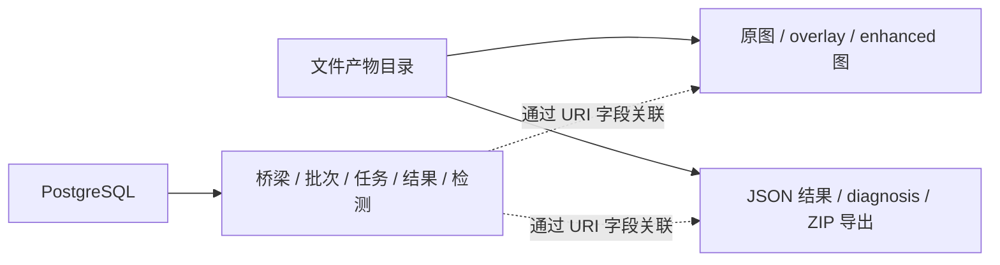

这种设计的优势是：

- 数据库查询快，结构清晰  
- 图片、overlay、增强图不塞入数据库  
- 导出与诊断文本可以独立管理

## B.7 关键字段与实现证明

为了说明这不是概念表设计，以下列出真实 ORM 字段片段。

```python
class InspectionBatch(Base):
    __tablename__ = "inspection_batches"

    bridge_id: Mapped[str] = mapped_column(ForeignKey("bridges.id"), nullable=False)
    batch_code: Mapped[str] = mapped_column(String(128), nullable=False, unique=True)
    status: Mapped[str] = mapped_column(
        String(32),
        CheckConstraint(
            "status in ('created','ingesting','running','completed','partial_failed','failed','cancelled')"
        ),
        nullable=False,
        default="created",
    )
```

```python
class Detection(Base):
    __tablename__ = "detections"

    category: Mapped[str] = mapped_column(String(64), nullable=False)
    confidence: Mapped[float] = mapped_column(Float, nullable=False)
    mask_payload: Mapped[Optional[dict]] = mapped_column(JSONB, nullable=True)
    length_mm: Mapped[Optional[float]] = mapped_column(Float, nullable=True)
    width_mm: Mapped[Optional[float]] = mapped_column(Float, nullable=True)
    area_mm2: Mapped[Optional[float]] = mapped_column(Float, nullable=True)
```

## B.8 数据库图表补充建议

建议补充以下真实素材：

- [报告/images/database/db-er.png](/Users/tim/BDI/报告/images/database/db-er.png)  
  数据库 ER 图或数据库设计图
- [报告/images/database/db-tables-core.png](/Users/tim/BDI/报告/images/database/db-tables-core.png)  
  核心数据表截图
- [报告/images/database/db-ops-config.png](/Users/tim/BDI/报告/images/database/db-ops-config.png)  
  告警配置/审计表截图

## B.9 小结

数据库设计的核心价值在于把“模型输出”变成“可追溯、可复核、可告警、可导出”的业务数据链路。桥梁、批次、任务、结果、检测、告警、复核并不是独立功能，而是一组围绕巡检闭环组织起来的实体系统。


<div style="page-break-after: always;"></div>
# 附录 C：系统运行与本地复现说明

## C.1 编写原则

本附录的目标是说明系统如何在本地完整运行，而不是给出生产运维手册。因此本附录只保留：

- 环境依赖
- 数据库准备
- 模型与运行时组织方式
- 前后端启动方式
- `bdi run` 的本地复现流程

本附录不写以下内容：

- 个人机器绝对路径
- 私有密钥、账号和令牌
- 面向公网部署的安全配置
- 生产级容器编排与集群运维细节

## C.2 运行环境

### C.2.1 硬件建议

| 项目 | 最低配置 | 推荐配置 |
|------|----------|----------|
| CPU | 4 核 | 8 核及以上 |
| 内存 | 8 GB | 16 GB 及以上 |
| 磁盘空间 | 50 GB | 100 GB 及以上 |
| GPU | 非必须 | NVIDIA GPU（用于加速推理） |

### C.2.2 软件环境

| 项目 | 建议版本 |
|------|----------|
| 操作系统 | macOS / Linux |
| Python | 3.9+ |
| Node.js | 18+ |
| PostgreSQL | 15+ |
| npm | 9+ |

## C.3 数据库与模型准备

### C.3.1 数据库准备

系统依赖 PostgreSQL 保存桥梁、批次、任务、结果、告警和复核数据。

最小准备流程：

```bash
createdb bdi
cd backend
alembic upgrade head
```

### C.3.2 模型与运行时准备

系统采用“模型权重 + vendored runtime”方式组织推理环境。

目录结构示意：

```text
backend/
├── models/              # 主模型、专项模型权重
└── external_runtimes/   # 对应运行时代码
```

当前系统至少需要：

- 主模型权重
- 渗水专项模型权重
- 裂缝专项模型权重
- 对应的外部 runtime 目录

增强能力如果启用，还需要增强模型权重或增强运行时配置。

## C.4 环境变量

环境变量建议参考：

- 后端环境变量示例文件
- 前端环境变量示例文件

后端至少需要配置：

- 数据库连接
- active model version
- artifact 根目录
- 模型权重与运行时路径

前端至少需要配置：

- `NEXT_PUBLIC_API_BASE_URL`

文档中只建议使用占位形式，例如：

```bash
BDI_DATABASE_URL=postgresql+psycopg://<user>:<password>@localhost:5432/bdi
BDI_MODEL_VERSION=fusion-main-water-crack-mask-v1
NEXT_PUBLIC_API_BASE_URL=http://127.0.0.1:8000
```

## C.5 本地启动方式

### C.5.1 推荐方式：`bdi run`

当前项目已经封装了本地一键启动脚本，推荐直接使用：

```bash
bdi run
```

这条命令的目标是：

- 启动后端
- 启动前端
- 检查基本依赖
- 进入真实链路模式

### C.5.2 分步启动方式

如果需要分开调试，也可以分别启动：

后端：

```bash
cd backend
uvicorn app.main:app --reload --host 127.0.0.1 --port 8000
```

前端：

```bash
cd frontend
npm run dev
```

## C.6 本地运行验证

启动完成后，建议至少验证以下内容：

1. `/health` 返回 `ready=true`
2. `/models` 能看到当前激活模型
3. 前端能正常打开桥梁页、批次工作台、历史页
4. 能完成一次桥梁创建 -> 批次创建 -> 图片上传 -> 详情查看

这也是当前 real-mode E2E 所覆盖的主要链路。

## C.7 本附录的适用边界

本附录适用于：

- 本地开发
- 项目验收
- 答辩演示
- 课程作业复现

本附录不等价于生产部署方案。  
如果后续进入商用或公网部署，需要另行补充：

- 认证与权限
- 安全策略
- 监控与备份
- 容器化或服务编排

## C.8 小结

对于当前项目阶段，部署说明只需要服务于“本地可跑、可演示、可复现”即可，不需要写到暴露个人环境细节或生产运维细节的程度。这种粒度更符合课程报告和项目说明的实际用途。


<div style="page-break-after: always;"></div>
# 附录 D：Markdown、Mermaid 与 Word 导出链路

## D.0 推荐 DOCX 导出链路

本章节稿不建议直接把 Markdown 交给 Word 或 Typora 导出，因为 Word 不认识 Mermaid 源码，直接转换会把图表变成代码块或丢失图形。推荐链路是：

1. 使用 Mermaid CLI 扫描 Markdown，把所有 `mermaid` 代码块渲染为 PNG 图片。
2. 使用 Pandoc 读取已替换图片链接的 Markdown，并生成 `.docx`。
3. 使用 Pandoc Lua filter 把 HTML 分页标记转换为 Word 原生分页符。
4. 解包 `.docx` 或用 Word/LibreOffice 检查 `word/media`，确认 Mermaid 图已经作为图片嵌入。

本仓库已提供脚本：

```bash
python3 scripts/export_report_docx.py --input 报告/第五章_软件系统全栈设计与实现.md --output output/doc/第五章_软件系统全栈设计与实现.docx
```

该脚本的核心处理顺序是：

```text
Markdown 源文件
  -> npx @mermaid-js/mermaid-cli 渲染 Mermaid 为 PNG
  -> 临时 rendered.md 替换 Mermaid 为图片引用
  -> pandoc + pagebreak.lua 生成 Word 文档
  -> output/doc/*.docx
```

对本章而言，标准 Markdown 表格由 Pandoc 原生转换为 Word 表格；Mermaid 图由脚本统一转成 PNG 后嵌入 Word，因此不会依赖 Word 原生理解 Mermaid。

## D.1 编写目的

本附录用于解决报告编写中的两个实际问题：

1. Mermaid 图在 Typora 中可能受主题影响，出现深色、对比度不足或尺寸不稳定  
2. 报告既可能导出为 PDF，也可能需要转为 Word

因此，本附录给出本报告的推荐预览与导出方式。

## D.2 当前报告的 Mermaid 规范

本报告中的 Mermaid 已统一采用以下约束：

- 不使用 `classDef`
- 不使用 `%%{init}`
- 不使用节点自定义颜色
- 不使用 `linkStyle` 或手工 `style`
- 仅使用：
  - `flowchart`
  - `graph`
  - `sequenceDiagram`
  - `erDiagram`

这样做的目的，是让 Mermaid 的显示效果尽量稳定，不依赖某一套编辑器主题。

## D.3 Typora 推荐设置

建议在 Typora 中使用浅色主题，并在主题 CSS 中加入以下变量：

```css
:root {
  --mermaid-theme: neutral;
  --mermaid-font-family: "PingFang SC", "Microsoft YaHei", sans-serif;
  --mermaid-flowchart-curve: linear;
}
```

如果希望正文区域不要过窄，可以额外增加：

```css
.md-content {
  max-width: 1100px;
}
```

## D.4 图尺寸统一原则

Mermaid 在 Typora 中很难做到“每张图强制同宽”，因此统一图尺寸的主要方法不是继续调样式，而是控制图本身：

1. 一张图只讲一件事  
2. 节点控制在 6 到 9 个左右  
3. 节点文字尽量控制在 6 到 14 个字  
4. 同一章中尽量统一方向：
   - 架构图优先 `TB`
   - 流程图优先 `LR`
   - 协作图优先 `sequenceDiagram`
5. 复杂链路拆成两张图，不把所有逻辑塞进一张图

## D.5 PDF 导出建议

对于当前这份报告，**PDF 是推荐的最终提交格式**。

建议导出流程：

1. 在 Typora 中切换到浅色主题  
2. 确认 `报告/images/*` 中的真实截图已放好  
3. 直接导出 PDF

优点：

- Mermaid 图通常能随文档一起稳定渲染  
- 图文排版更适合答辩和归档  
- 不需要额外转换图格式

## D.6 Word 导出建议

Word 可以导出，但不建议直接依赖 Word 原生保留 Mermaid。

更稳的做法是：

1. 先把关键 Mermaid 图导出为 PNG / SVG  
2. 再把这些图片插入 Word  
3. Word 用于编辑版或校稿版，PDF 用于最终版

优先建议转图片的图包括：

- 图 2-1 系统总体分层架构
- 图 2-4 批量运行时协作与结果落库链路
- 图 4-5 历史、复核与告警闭环
- 图 5-7 模型引擎与多专项融合结构
- 图 5-10 批量异步处理链路

## D.7 素材目录建议

当前报告建议统一使用以下目录：

- [报告/images/architecture](/Users/tim/BDI/报告/images/architecture)
- [报告/images/screenshots](/Users/tim/BDI/报告/images/screenshots)
- [报告/images/database](/Users/tim/BDI/报告/images/database)
- [报告/images/algorithm](/Users/tim/BDI/报告/images/algorithm)

如果需要把 Mermaid 单独导出成图片，也建议按语义落到对应目录，而不是散放在根目录。

## D.8 小结

本报告推荐的交付策略是：

- 日常编辑：Typora + 浅色主题  
- 最终提交：PDF  
- 如需 Word：关键 Mermaid 图先转图片，再嵌入 Word


<div style="page-break-after: always;"></div>
# 附录 E：项目结构与关键目录说明

本附录用于补充正文中未展开的源码导航信息。正文负责说明系统如何设计、如何协作、如何形成业务闭环；本附录负责说明这些设计在工程中的主要落点，帮助读者把“系统结构”与“源代码位置”建立对应关系。

---

## E.1 根目录结构

```text
BDI/
├── backend/                         # 后端服务、数据库模型、模型接入层
├── frontend/                        # 前端页面、组件、客户端封装、E2E 测试
├── scripts/                         # 一键启动与开发脚本
├── docs/                            # 开发说明与内部文档
└── 报告/                            # 本项目报告与附录
```

根目录的版本控制主结构以业务主链路目录与仓库级配置为主。数据库缓存、编译缓存、浏览器测试产物等临时文件不进入版本控制，并通过 `.gitignore` 管理。

---

## E.2 从业务主链路理解项目结构

系统的主业务链路可以概括为：

```text
桥梁资产 -> 巡检批次 -> 图片记录 -> 异步任务 -> 推理结果 -> 历史回查 / 复核 / 告警
```

围绕这条主链路，源码可以按四层理解：

| 层次 | 主要位置 | 说明 |
|------|----------|------|
| 页面承接层 | `frontend/app/`、`frontend/src/components/` | 负责桥梁、批次、历史、详情、告警、复核、设置等页面承接 |
| 客户端与状态层 | `frontend/src/lib/`、页面状态模块 | 负责接口调用、状态同步、轮询与动作处理 |
| 接口与服务层 | `backend/app/api/`、`backend/app/services/` | 负责参数接收、业务编排、查询与写入协作 |
| 数据与引擎层 | `backend/app/db/`、`backend/app/models/`、`backend/app/adapters/` | 负责 ORM、协议模型、模型运行时与融合逻辑 |

---

## E.3 后端结构

### E.3.1 后端总览

```text
backend/
├── app/
│   ├── api/                         # 接口入口
│   │   ├── routes.py                # 单图推理、增强、结果、诊断、导出
│   │   └── v1_routes.py             # 桥梁、批次、任务、检测、复核、告警、设置
│   ├── core/                        # 配置、错误处理、类别归一化、运行时状态、共享常量与工具函数
│   ├── db/                          # 数据库基类、会话、ORM 模型
│   ├── models/                      # Pydantic 请求/响应模型与兼容导出层
│   ├── services/                    # Batch / Task / Result / Predict / LLM 等业务服务
│   ├── adapters/                    # runner、fusion、增强、外部运行时适配
│   └── storage/                     # 本地文件存储适配
├── alembic/                         # 数据库迁移脚本
├── external_runtimes/               # 外部模型运行时代码
├── models/                          # 正式纳入仓库管理的模型权重
├── requirements.txt                 # 基础后端依赖
└── requirements-yolo.txt            # 推理运行时依赖
```

### E.3.2 接口入口层

```text
backend/app/api/
├── routes.py                        # Legacy API
└── v1_routes.py                     # V1 Ops API
```

| 文件 | 作用 | 对应正文 |
|------|------|----------|
| `routes.py` | 承接单图推理、结果读取、增强补算、诊断生成、导出 | 第 4 章、5.2 节 |
| `v1_routes.py` | 承接桥梁、批次、任务、检测、复核、告警、设置 | 第 2 章、4.2、4.3、5.2 节 |

接口层本身保持薄层，主要完成参数接收、响应声明和服务转发。下例展示批次创建的接口入口形式：

```python
@router.post("/batches", response_model=BatchCreateResponse, status_code=status.HTTP_201_CREATED)
async def create_batch(request: Request, payload: BatchCreateRequest) -> BatchCreateResponse:
    return request.app.state.batch_service.create_batch(payload)
```

这类写法说明：真正的业务编排不放在路由层，而是交给门面服务处理。

### E.3.3 业务服务层

```text
backend/app/services/
├── batch_service.py                 # 批次门面服务
├── batch_validation_service.py      # 批次与上传校验
├── batch_ingest_service.py          # 批量素材入库
├── batch_write_service.py           # 批次写操作
├── batch_alert_review_service.py    # 告警与复核联动
├── batch_query_service.py           # 批次查询
├── batch_item_query_service.py      # 素材与详情查询
├── ops_query_service.py             # 运营视角查询
├── task_service.py                  # 任务门面服务
├── task_execution_service.py        # 任务执行
├── task_retry_service.py            # 失败任务重试
├── task_enhancement_service.py      # 增强补算
├── task_alert_service.py            # 任务相关告警
├── result_service.py                # 结果、历史、导出、诊断
├── predict_service.py               # 单图推理服务
├── protocols.py                     # 门面服务 Protocol 接口定义
└── llm_service.py                   # 诊断文本生成
```

| 服务组 | 典型文件 | 作用 |
|--------|----------|------|
| 批次服务组 | `batch_service.py` 与相关子服务 | 批次创建、上传、删除、查询、统计、告警复核联动 |
| 任务服务组 | `task_service.py` 与相关子服务 | 任务调度、执行、重试、增强补算 |
| 结果服务组 | `result_service.py`、`predict_service.py` | 单图结果、历史结果、导出、诊断 |
| 运维辅助服务 | `llm_service.py` | 将检测结果转为可读诊断文本 |

任务门面和执行模块之间的关系也保持稳定。下例展示任务门面把执行逻辑委托给专门执行服务的方式：

```python
def process_next_queued_task(self) -> TaskProcessResponse:
    return process_next_queued_task_via_service(self)
```

这种门面结构的意义在于：对外接口保持稳定，而执行、重试、增强和告警逻辑可以继续独立演进。

### E.3.4 模型接入层

```text
backend/app/adapters/
├── manager.py                       # RunnerManager
├── registry.py                      # 模型注册与解析
├── fusion_runner.py                 # 多模型融合
├── external_ultralytics_runner.py   # 外部 Ultralytics 运行时
├── enhancement_runner.py            # 图像增强 runner
├── output_adapter.py                # 推理结果统一转换
└── ...                              # 其他 runner 与适配器
```

| 文件 | 作用 | 对应正文 |
|------|------|----------|
| `registry.py` | 声明主模型、专项模型、fusion 版本 | 第 2.6、5.4.3 节 |
| `manager.py` | 根据模型配置装配 runner | 第 2.4、5.4.3 节 |
| `fusion_runner.py` | 合并主模型与专项模型输出 | 第 2.6、5.6.4 节 |
| `enhancement_runner.py` | 生成增强图并驱动增强后识别 | 第 4.4、5.4.4 节 |
| `output_adapter.py` | 把不同 runner 输出统一为同一套结果协议 | 第 2.6、3.2、5.4.3 节 |

当前多模型融合并不是简单串联，而是“注册 -> 装配 -> 执行 -> 统一结果”。下例展示融合运行时的配置结构：

```python
{
    "model_version": "fusion-main-water-crack-mask-v1",
    "runner_kind": "fusion",
    "primary_model_version": "main-latest-mask-v1",
    "specialist_overrides": {
        "seepage": "water-latest-mask-v1",
        "crack": "crack-latest-mask-v1",
    },
}
```

这类配置使主模型、渗水专项模型和裂缝专项模型可以在统一协议下协同工作。

### E.3.5 数据模型与持久化

```text
backend/app/db/
├── base.py
├── session.py
└── models.py                        # ORM 模型定义

backend/app/models/
├── common.py
├── batch.py
├── results.py
├── ops.py
└── schemas.py                       # 兼容导出层
```

| 层次 | 典型文件 | 作用 |
|------|----------|------|
| ORM 模型 | `db/models.py` | 定义桥梁、批次、任务、结果、检测、告警、复核等表 |
| 协议模型 | `models/batch.py`、`models/results.py`、`models/ops.py` | 定义请求/响应结构 |
| 兼容导出 | `models/schemas.py` | 保持旧导入路径稳定 |

---

## E.4 前端结构

### E.4.1 前端总览

```text
frontend/
├── app/
│   ├── dashboard/
│   │   ├── bridges/                 # 桥梁资产与桥梁详情
│   │   ├── history/                 # 历史档案
│   │   ├── lab-single/              # 单图实验页（次要入口）
│   │   └── ops/                     # 工作台、告警、复核、设置
│   ├── meeting-showcase/            # 展示页
│   ├── layout.tsx                   # 应用布局
│   └── page.tsx                     # Landing 首页
├── src/
│   ├── components/                  # 页面组件、局部区块、动画组件
│   └── lib/                         # API 客户端、类型、工具函数
├── e2e/                             # Playwright real-mode 回归
└── package.json                     # 前端依赖与脚本
```

### E.4.2 页面入口层

```text
frontend/app/dashboard/
├── bridges/
│   ├── page.tsx
│   └── [bridgeId]/page.tsx
├── history/page.tsx
├── ops/
│   ├── page.tsx
│   ├── alerts/page.tsx
│   ├── reviews/page.tsx
│   ├── settings/page.tsx
│   └── items/[batchItemId]/page.tsx
└── lab-single/page.tsx
```

| 页面入口 | 主要用途 | 对应正文 |
|----------|----------|----------|
| `bridges/page.tsx` | 桥梁资产列表 | 第 4.2、4.3 节 |
| `bridges/[bridgeId]/page.tsx` | 桥梁详情 | 第 2.3、4.3 节 |
| `ops/page.tsx` | 批次工作台 | 第 4.2、5.3 节 |
| `ops/items/[batchItemId]/page.tsx` | 单图详情 | 第 4.1、4.4、5.3 节 |
| `ops/alerts/page.tsx` | 告警中心 | 第 4.3 节 |
| `ops/reviews/page.tsx` | 复核中心 | 第 4.3 节 |
| `ops/settings/page.tsx` | 设置页 | 第 4.3 节 |
| `history/page.tsx` | 历史档案 | 第 4.3 节 |

### E.4.3 页面组件层

```text
frontend/src/components/
├── bridges/
│   ├── bridge-assets-shell.tsx
│   └── bridge-detail-shell.tsx
├── history/
│   ├── history-batch-panel.tsx
│   ├── history-record-list-panel.tsx
│   └── use-history-route-state.ts
├── ops/
│   ├── ops-workbench-shell.tsx
│   ├── ops-workbench-main.tsx
│   ├── use-ops-workbench-controller.ts
│   ├── use-ops-workbench-state.ts
│   ├── use-ops-workbench-data.ts
│   ├── use-ops-workbench-actions.ts
│   ├── ops-item-detail-shell.tsx
│   ├── ops-alerts-shell.tsx
│   ├── use-ops-alerts-state.ts
│   ├── ops-alerts-list.tsx
│   └── ops-alerts-bulk-bar.tsx
└── result-dashboard*.tsx            # 单图结果展示与分析
```

| 组件组 | 关键文件 | 作用 |
|--------|----------|------|
| 桥梁页 | `bridge-assets-shell.tsx`、`bridge-detail-shell.tsx` | 承接桥梁资产列表与桥梁详情 |
| 历史页 | `history-route-shell.tsx`（组件根目录）与 `history/*` 子组件 | 承接历史批次、记录清单与详情跳转 |
| 工作台 | `ops-workbench-shell.tsx` 与相关状态模块 | 承接桥梁/批次切换、上传、轮询、详情跳转 |
| 单图详情 | `ops-item-detail-shell.tsx`、`result-dashboard.tsx` | 承接结果切换、增强、诊断、导出 |
| 告警页 | `ops-alerts-shell.tsx` 等 | 承接告警筛选、状态更新、批量操作 |

### E.4.4 前端客户端与状态层

```text
frontend/src/lib/
├── predict-client.ts                # 对外统一导出层
├── predict-client-base.ts           # fetch、apiGet/apiPost/apiPut/apiDelete 泛型请求、缓存基础
├── predict-client-bridges.ts        # 桥梁接口
├── predict-client-batches.ts        # 批次接口
├── predict-client-alerts.ts         # 告警接口
├── predict-client-reviews.ts        # 复核接口
├── predict-client-settings.ts       # 设置接口
├── predict-client-detections.ts     # 检测接口
├── predict-client-results.ts        # 单图结果链路
└── types.ts                         # 业务类型门面层
```

前端客户端层的作用，是把页面语义与接口字段适配分开。这样页面只处理桥梁、批次、结果来源、增强模式等业务概念，而不直接耦合后端请求细节。

详情页核心状态则由页面状态层承接。下例展示详情页三组最关键的视图状态：

```typescript
const [imageSource, setImageSource] = useState<"original" | "enhanced">("original");
const [resultSource, setResultSource] = useState<"original" | "enhanced">("original");
const [viewMode, setViewMode] = useState<"image" | "overlay" | "mask">("overlay");
```

这三组状态分别控制底图来源、结果来源与图像展示模式，是增强结果能够与主结果并行承接的关键。

---

## E.5 数据与表结构导航

### E.5.1 核心业务表

```text
数据库主链路
├── bridges
├── inspection_batches
├── batch_items
├── inference_tasks
├── inference_results
├── detections
├── alert_events
└── review_records
```

| 表名 | 作用 | 对应正文 |
|------|------|----------|
| `bridges` | 桥梁资产主体 | 第 4.2、附录 B |
| `inspection_batches` | 巡检批次主体 | 第 4.2、附录 B |
| `batch_items` | 批次内图片记录 | 第 4.2、附录 B |
| `inference_tasks` | 异步任务队列 | 第 2.5、5.5、附录 B |
| `inference_results` | 单图推理结果 | 第 4.1、5.4、附录 B |
| `detections` | 结构化病害明细 | 第 4.1、4.4、附录 B |
| `alert_events` | 告警记录 | 第 4.3、附录 B |
| `review_records` | 人工复核记录 | 第 4.3、附录 B |

### E.5.2 媒体与产物文件

```text
文件产物
├── 原始图片
├── overlay 结果图
├── mask / 增强结果图
├── 结构化 JSON 结果
└── 导出压缩包
```

这些媒体与产物并不全部进数据库，而是和结构化业务数据形成“双轨存储”：数据库负责结构化关系，文件系统负责承接体积更大的图像和导出产物。

---

## E.6 测试与回归结构

```text
测试链路
├── backend/tests/                   # 后端单元测试、集成测试
├── frontend/src/**/*.test.tsx       # 前端组件与工具测试
└── frontend/e2e/                    # real-mode 浏览器回归
```

当前 real-mode E2E 已覆盖：

- 主链路冒烟
- 上传校验
- 批次工作台联动
- 历史档案
- 复核页
- 告警页
- 设置页
- 桥梁删除级联
- 桥梁详情页

这也是本项目报告中能够强调“软件系统已形成闭环”的重要证据之一。

---

## E.7 如何配合正文阅读

若读者希望进一步理解系统，可按以下顺序阅读：

1. 先阅读第 2 章，理解系统总体分层与主链路；  
2. 再阅读第 3、4、5 章，理解技术实现、功能模块和软件设计；  
3. 若需要对照源码位置，再阅读本附录；  
4. 若需要进一步查看接口、数据库或运行方式，再结合附录 A、B、C 阅读。  

这种安排使正文保持可读性，而附录 E 负责补齐源码可追踪性。


<div style="page-break-after: always;"></div>
